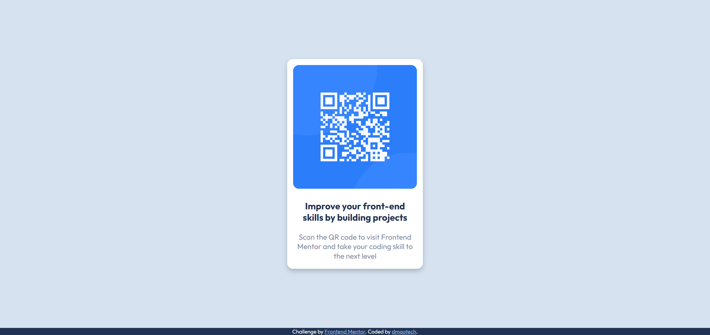

# Frontend Mentor - QR code component solution

This is a solution to the [QR code component challenge on Frontend Mentor](https://www.frontendmentor.io/challenges/qr-code-component-iux_sIO_H). 

## Table of contents

- [Overview](#overview)
  - [Screenshot](#screenshot)
  - [Links](#links)
- [My process](#my-process)
  - [Built with](#built-with)
- [Author](#author)

## Overview

### Screenshot

### Links

- Solution URL: [Soon]()
- Live Site URL: [Soon]()

## My process
> I started with the QR card structure in html, once this is done i begun with the css styles, puting the card in the center of the main block using flexbox, added colors and smooth borders making it look like the design.

### Built with

- Semantic HTML5 markup
- CSS custom properties
- Flexbox
- Desktop-first workflow

## Author

- Website - [Soon]()
- Frontend Mentor - [@dmaotech](https://www.frontendmentor.io/profile/dmaotech)
- Twitter - [Soon]()
